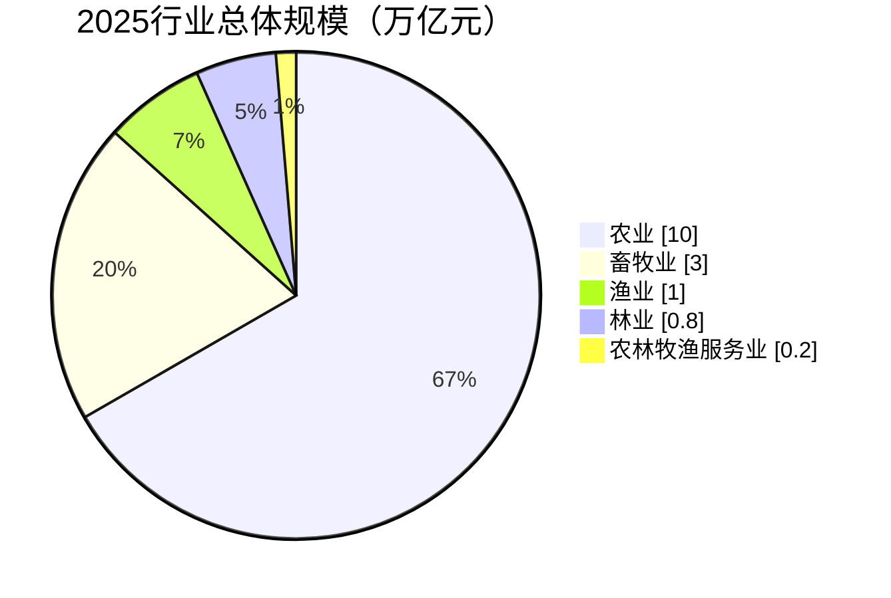
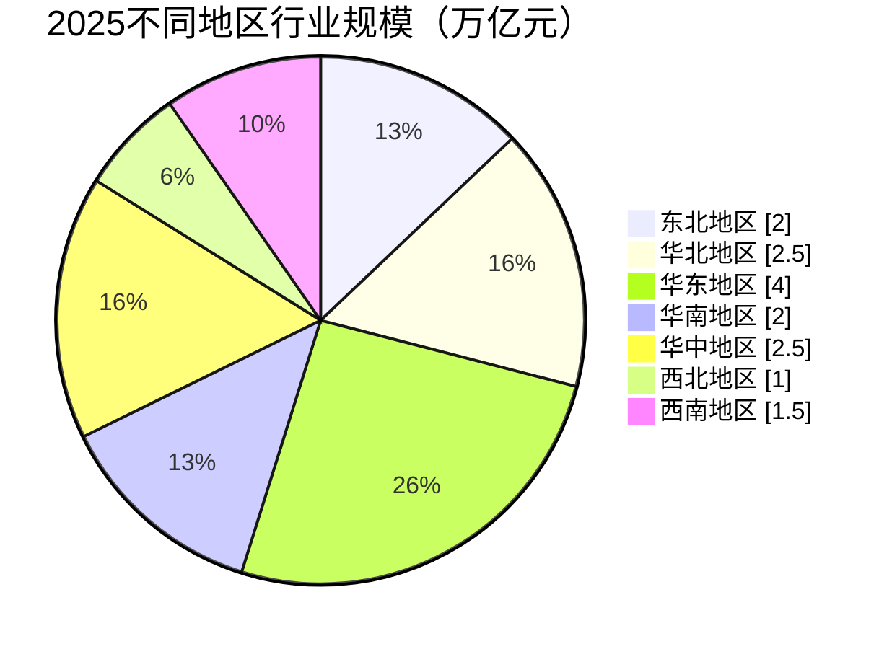
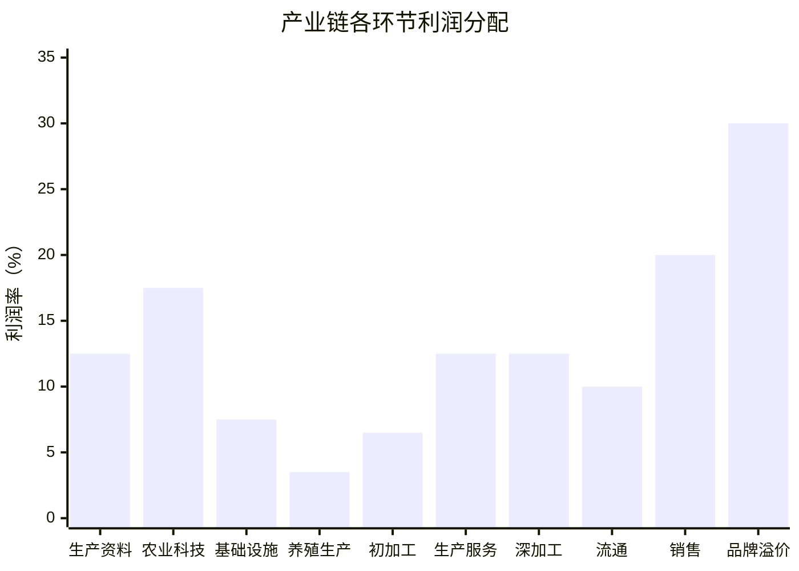
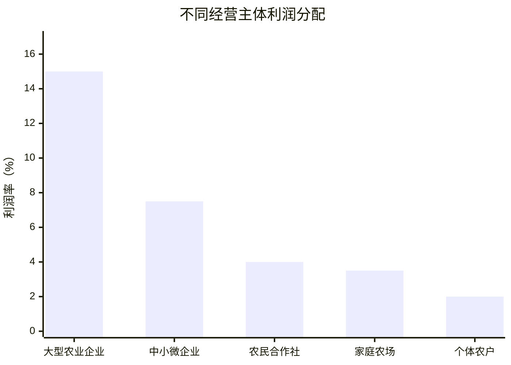
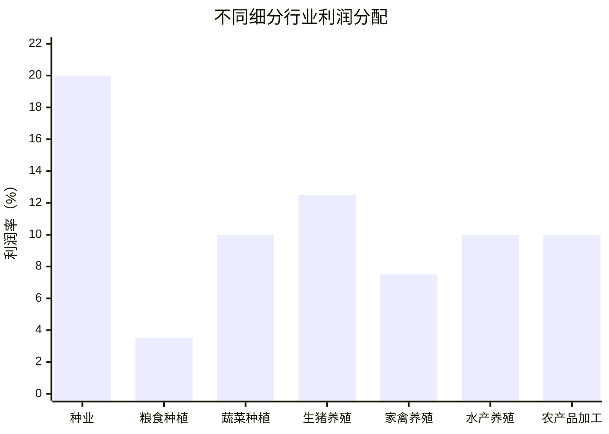

# 中国农林牧渔行业分析研究框架

## 1 行业概述与宏观环境

### 1.1 农林牧渔行业的战略地位和特征

农林牧渔行业作为国民经济的基础产业，在保障国家粮食安全、提供农产品供给、维护生态平衡等方面发挥着不可替代的作用。2025 年，中国农林牧渔行业已进入高质量发展阶段，行业规模持续扩大，预计全年总产值将达到 **15 万亿**元左右，**占 GDP 比重保持在 7%** 左右。

**行业基本特征**主要表现为：

- 生产周期长
- 受自然环境影响大
- 产业链条长
- 区域性特征明显
- 政策依赖性强等

这些特征决定了农林牧渔行业投资决策需要考虑更多的**不确定性因素**和**长期回报周期**​。

### 1.2 宏观政策环境分析

**国家粮食安全战略**是农林牧渔行业发展的核心政策导向。2025 年中央一号文件明确提出 "全方位夯实国家粮食安全根基，抓好粮食等重要农产品稳产保供" 的战略要求，强调深入推进粮油作物大面积单产提升行动，加力落实新一轮千亿斤粮食产能提升任务​。​

**农业农村改革政策**持续深化。2025 年是 "十四五" 规划收官之年，也是我国推进农业高质量发展、建设农业强国的关键时期。《中共中央 国务院关于进一步深化农村改革扎实推进乡村全面振兴的意见》中明确提出要 "稳定和完善农村土地承包关系"，坚持 "大稳定、小调整"，有序推进第二轮土地承包到期后再延长三十年试点，扩大整省试点范围​。​

**农业支持保护政策**体系不断完善。2025 年，中央财政强农惠农富农政策清单明确，将通过财政资金直接拨入种地农民个人账号的方式，确保各项补贴资金直达农户，杜绝第三方截留​。此外，稻谷、小麦最低收购价政策，玉米大豆生产者补贴、稻谷补贴政策，以及耕地地力保护补贴政策均保持稳定​。​

**绿色农业发展政策**力度加大。2025 年，中国继续深入实施农业绿色发展战略，推进农业面源污染防治，加强受污染耕地安全利用，推动农业投入品减量化、废弃物资源化，发展生态低碳农业​。同时，《中国农业展望报告（2025-2034）》提出，未来 10 年中国农业将在高质量发展方面取得新成效，农业科技创新能力进一步增强，乡村产业发展水平进一步提升​。

### 1.3 经济周期与行业关联性分析

农林牧渔行业与宏观经济周期存在明显的关联性，但由于其基础产业特性，**行业波动通常滞后于宏观经济波动**。这主要归因于三方面因素：

- 农林牧渔行业**生产周期较长**，从农作物播种、生长到收获，或畜禽从幼崽养殖至出栏，都需要固定的时间跨度，即便宏观经济环境发生变化，生产过程也难以立即调整；
- 农产品作为生活必需品，**需求弹性较小**，宏观经济下行时消费需求不会显著下降，经济上行时需求增长也有限，使得价格和供需调整存在滞后性；
- **行业产业链条复杂**，涉及种植养殖、加工、流通等多个环节，各环节对宏观经济信号的响应和传导存在时滞，叠加政策调控、自然灾害等外部因素影响，进一步加剧了行业波动滞后于宏观经济波动的特性。

2025 年上半年，中国宏观经济保持稳健增长，GDP 增速达到 5.5% 左右，为农林牧渔行业提供了良好的外部环境​。

​
**农产品价格周期**是影响行业景气度的关键因素。2025 年上半年，农产品价格总体保持稳定，部分品种价格有所波动。生猪价格从年初的 15 元 /kg 左右，小幅上涨至年中的 16 元 /kg 左右；而鸡蛋、鸡肉等价格则出现一定程度的下跌​。**从长期来看，随着居民收入水平提高和消费结构升级，农产品需求将保持稳定增长，但增速可能放缓**​。
​

**农产品进出口贸易**受全球经济和贸易政策影响显著。2025 年 1-6 月，中国农产品进出口总额达 **1.2 万亿**元，同比增长 15%​。其中，大豆、玉米等谷物进口量有所减少，而肉类进口则因国内需求增加而有所上升。预计 2025 年全年粮食进口量将维持在 **1 亿吨**左右的较高水平​。​

**农业产业链金融**支持力度不断加大。2025 年，中国继续实施现代设施农业建设贷款贴息试点政策，开展粮油种植专项贷款贴息试点，扎实推进脱贫人口小额信贷，推进畜禽活体、农业设施等抵押融资贷款​。同时，多层次农业保险体系不断完善，稻谷、小麦、玉米、大豆完全成本保险和种植收入保险政策持续推进，产粮大县农业保险县级保费补贴承担比例进一步降低​。


### 1.4 社会文化因素分析

**人口结构变化**对农林牧渔行业产生深远影响。2025 年，中国人口老龄化程度进一步加深，农村劳动力人口持续减少，农业劳动力平均年龄已超过 50 岁，这一趋势推动了农业机械化、智能化发展​。同时，新生代农民逐渐成为农业生产的主力军，他们对新技术、新模式的接受度更高，推动了农业生产方式的变革。​


**消费升级**趋势明显，高品质农产品需求增加。2025 年，中国居民食品消费结构持续升级，对优质、安全、绿色、健康的农产品需求不断增长。预计到 2025 年底，绿色、有机、地理标志农产品认证数量将超过 6 万个，**市场规模将达到 2 万亿元以上**​。​

**乡村振兴战略**推动农村一二三产业融合发展。2025 年，中国继续深入推进乡村振兴战略，培育乡村新产业新业态，推动乡村产业高质量发展。预计到 2025 年底，休闲农业和乡村旅游接待人次将达到 30 亿人次，营业收入将超过 1.2 万亿元​。​

**城乡融合发展**加速推进。2025 年，中国城镇化率已达到 66% 左右，**城乡居民收入比进一步下降到 2.30 左右**​
。城乡要素自由流动、平等交换的体制机制不断完善，为农林牧渔行业发展带来新机遇。


### 1.5 技术创新与数字化转型趋势

**农业科技创新**能力持续提升。2025 年，中国农业科技进步贡献率已超过 63%，农业科技创新整体水平已位居全球前列​。农业农村部发布的《农业科技领域技术创新指南（2024-2028 年）》明确了未来 5 年农业科技创新的 10 个重点领域，包括作物新品种培育、耕地质量提升、绿色低碳农业发展等​。​

**智慧农业**发展迅速。2025 年，中国智慧农业市场规模预计将达到 **2000 亿元**，年复合增长率超过 20%​。农业物联网、大数据、人工智能等技术在农业生产中的应用不断深化，预计到 2025 年底，全国农业物联网设备联网数量将超过 3000 万台（套），智能农机装备保有量将达到 500 万台（套）以上​。​

**生物育种**技术应用加速。2025 年，中国转基因玉米种子制种面积达 20 万亩，预计 2025 年种植面积将突破 5000 万亩，2026 年开始进入 "亿亩时代"​。生物育种技术的应用将大幅提高农作物产量和品质，推动种业升级。​

**农产品冷链物流技术**不断进步。2025 年，中国冷链物流市场规模年增速超 15%，预计 2025 年突破 **9000 亿元**。冷链物流技术的发展大幅降低了农产品损耗率，延长了农产品保鲜期，促进了农产品流通和销售。


### 1.6 环境与可持续发展因素

**耕地资源保护**力度加大。2025 年，中国继续坚持最严格的耕地保护制度，严守 18 亿亩耕地红线。全国高标准农田建设持续推进，预计到 2025 年底，累计建成高标准农田将超过 10 亿亩，有效提高了耕地质量和粮食产能​。​

**农业面源污染防治**成效显著。2025 年，中国深入推进农业面源污染防治，实施化肥农药减量增效行动，推广绿色防控技术，推进畜禽粪污资源化利用、秸秆综合利用和地膜科学使用回收​。预计到 2025 年底，化肥农药使用量将实现连续 8 年负增长，畜禽粪污综合利用率将达到 80% 以上。​

**水资源节约利用**水平提高。2025 年，中国继续推进农业水价综合改革和用水权改革，加强取用水管理，持续推进地下水超采治理，推广运用节水灌溉技术​。预计到 2025 年底，全国农业灌溉水有效利用系数将提高到 0.58 以上，节水灌溉面积将达到 7 亿亩以上。​

**生态农业**发展迅速。2025 年，中国积极发展大水面生态渔业，科学发展稻渔综合种养和盐碱地水产养殖，在西北等地区因地制宜发展冷水鱼​。同时，长江十年禁渔政策持续推进，水生生物资源得到有效保护​。生态农业模式的推广，有效促进了农业可持续发展。


### 1.7 法律与政策风险分析

**农业法律法规体系**不断完善。2025 年，中国加快推进农业法、耕地保护和质量提升法、渔业法等法律法规修订进程，完善配套规章​。同时，深化农业综合行政执法改革，落实行政裁量权基准制度，强化执法培训，严厉打击坑农害农违法行为​。​

**农产品质量安全监管**加强。2025 年，中国继续深化重点问题品种药物残留治理，加快推广胶体金等新型速测技术，健全联动高效的风险监测评估制度，全面落实食用农产品承诺达标合格证制度​。同时，加快农兽药残留限量及检测方法标准制修订，深入推进兽用抗菌药使用减量化行动​。​

**动植物防疫检疫体系**不断健全。2025 年，中国继续加强非洲猪瘟等重大动物疫病和布鲁氏菌病等重点人畜共患病防控​。同时，加强外来入侵物种防控，保障农业生物安全​。预计到 2025 年底，全国动物疫病强制免疫覆盖率将达到 90% 以上，重大动物疫情发生率将控制在较低水平。​

**国际农产品贸易规则变化**带来不确定性。2025 年，全球农产品贸易格局正在发生深刻变化，**贸易保护主义抬头**，技术性贸易壁垒增加，给中国农产品进出口带来挑战​。同时，**气候变化**、**地缘政治**等因素也增加了国际农产品市场的不确定性。


## 2 行业结构分析：波特五力模型

### 2.1 现有竞争者分析

农林牧渔行业现有**竞争者数量众多**，竞争格局呈现明显的**层级分化**和**区域集中**特征。2025 年，行业整体竞争格局可概括为 "**大企业主导、中小企业并存、合作社补充**" 的多元化格局​。​

**行业集中度逐步提高**。2025 年，中国农林牧渔行业集中度呈现稳步提升趋势，特别是在生猪养殖、饲料生产、种业等细分领域。

> 以生猪养殖为例，前 10 大养殖企业市场份额已从 2020 年的约 10% 提高到 2025 年的约 25%，其中牧原股份、温氏股份等龙头企业市场份额持续扩大​。

> 在饲料行业，前 10 大企业市场份额已超过 50%，海大集团、新希望等企业优势明显​。​

**竞争主体多元化**。农林牧渔行业竞争主体包括大型农业企业、中小微企业、农民合作社、家庭农场和个体农户等多种类型。2025 年，全国农民合作社数量已超过 220 万家，家庭农场数量超过 900 万家，成为推动农业现代化的重要力量​。不同类型主体在不同细分领域各具优势：

- 大型企业在资金、技术、品牌等方面具有优势；
- 合作社和家庭农场在组织农户、对接市场方面发挥重要作用；
- 个体农户则在特色农产品生产方面具有独特优势。​

**区域竞争差异明显**。中国农林牧渔行业竞争格局存在显著的区域差异。
- 东北地区以粮食种植为主，北大荒集团等**大型国有企业占据主导地位**；
- 华北地区以蔬菜、水果等经济作物种植和奶牛养殖为主，**竞争较为激烈**；
- 华东地区以水产养殖和农产品加工为主，**龙头企业优势明显**；
- 华南地区以热带作物种植和生猪养殖为主，**温氏股份等企业占据主导地位**；
- 西部地区以特色农业和草原畜牧业为主，**竞争相对缓和**​。​

**竞争手段多样化**。农林牧渔行业竞争手段日益多样化，包括价格竞争、产品差异化竞争、服务竞争、品牌竞争等。2025 年，随着消费升级和食品安全意识提高，产品差异化竞争和品牌竞争成为主流。

> 例如，北大荒通过 "绿色有机" 品牌定位（如 "九三" 豆油、"完达山" 乳制品）提升产品附加值，其有机大米价格较普通大米高 30%-50%，但市场份额持续增长​。

### 2.2 潜在进入者分析

农林牧渔行业潜在进入者面临的进入**壁垒较高**，特别是在**规模化生产、技术、资金**等方面。2025 年，行业进入壁垒主要体现在以下几个方面：​

**政策与资质壁垒**。农林牧渔行业受到严格的政策监管和资质要求。

> 例如，种业企业需要取得农作物种子生产经营许可证，生猪养殖企业需要符合环保要求并取得动物防疫条件合格证，水产养殖企业需要取得水域滩涂养殖使用证等​。

新进入者需要满足一系列政策要求和资质条件，增加了进入难度。​

**土地资源壁垒**。土地是农林牧渔行业的**核心生产要素**，而优质土地资源**日益稀缺**。2025 年，中国耕地资源紧张，优质农田**大多已被现有经营者占据**。

> 例如，北大荒拥有 4681.9 万亩耕地，占黑龙江省国有耕地的 70% 以上，且**政策限制耕地流转**，新进入者难以获取大规模土地资源​。此外，林地、草原、水域等资源也存在类似问题。​

**资金与规模壁垒**。农林牧渔行业规模化经营趋势明显，需要大量资金投入。

> 例如，建设一个万头猪场需要投资数千万元，建设一个现代化种子企业需要数亿元投入​。

新进入者面临巨大的资金压力，且难以在短期内达到规模经济，导致成本较高，竞争力不足。​

**技术与人才壁垒**。农林牧渔行业技术含量不断提高，对专业人才需求增加。2025 年，农业现代化需要大量掌握现代农业技术的人才，包括育种专家、养殖技术人员、农业机械工程师等​。新进入者往往缺乏相关技术积累和人才储备，难以在短期内形成技术优势。​

**品牌与渠道壁垒**。农林牧渔行业品牌建设和渠道拓展需要长期积累。现有企业已建立起稳定的销售渠道和品牌影响力，新进入者需要投入大量资源开拓市场、建立品牌，面临较高的市场开拓成本和品牌建设难度​。​

尽管存在较高进入壁垒，2025 年仍有一些新进入者通过差异化竞争和创新模式进入农林牧渔行业：​

**跨界企业进入**。一些来自互联网、食品、金融等领域的企业通过跨界整合进入农林牧渔行业。例如，美团、京东等互联网企业通过**布局农产品电商和冷链物流**进入农业领域；中粮集团、光明食品等食品企业通过**向上游延伸进入种植、养殖领域​**。​

**科技创新型企业**。一些专注于农业科技创新的企业通过技术创新进入农林牧渔行业。例如，一些生物育种企业通过**基因编辑技术**进入种业市场；一些智慧农业企业通过**农业物联网**和**大数据技术**进入农业服务领域​。​

**返乡创业群体**。随着乡村振兴战略实施，一批返乡创业人员通过发展特色农业、休闲农业等新业态进入农林牧渔行业。2025 年，全国返乡入乡创业创新人员已超过 1200 万人，创办各类经营主体超过 700 万个，成为推动农业农村发展的新生力量​。


### 2.3 替代品威胁分析

农林牧渔行业替代品威胁主要来自以下几个方面：​

**农产品替代品**。随着科技发展和消费升级，传统农产品面临多种替代品挑战。例如，**植物基蛋白产品**（如植物肉、植物奶）对传统肉类和乳制品的替代；**人造海鲜产品**对天然水产品的替代；**合成纤维**对天然纤维（如棉花、蚕丝）的替代等​。

> 2025 年，全球植物基蛋白市场规模已达到约 500 亿美元，年增长率超过 20%，对传统畜牧业形成一定替代压力。​

**食品消费结构变化**。随着居民生活水平提高和饮食习惯改变，食品消费结构发生变化，对农林牧渔行业产生深远影响。例如，主食消费减少，肉蛋奶、蔬菜、水果等副食消费增加；直接食用农产品减少，加工食品消费增加等​。

> 2025 年，中国居民人均直接粮食消费量已从 2015 年的 150 公斤左右下降到 2025 年的约 130 公斤，而肉蛋奶消费量则持续增长。​

**农业生产方式变革**。随着农业生产技术进步，一些传统农业生产方式面临替代。例如，**垂直农场**、**植物工厂**等新型农业生产方式可以在有限空间内实现高效生产，对传统大田种植形成一定替代；工厂化养殖对传统散养方式形成替代等​。

> 2025 年，中国植物工厂面积已超过 100 万平方米，产量达到数十万吨，主要生产高品质蔬菜和药用植物。​

**农业功能拓展**。随着城乡融合发展和消费升级，农业功能从传统的农产品生产向生态观光、休闲体验、文化传承等多功能拓展。例如，休闲农业、乡村旅游、农业研学等新业态的兴起，使农业的经济价值、生态价值、文化价值得到全面发挥​。这些新业态在一定程度上替代了传统农业生产功能，但同时也为农业发展开辟了新空间。​

尽管存在多种替代威胁，农林牧渔行业的核心地位难以被完全替代，主要原因包括：​

**农产品的不可替代性**。粮食等基本农产品是人类生存的必需品，具有不可替代性。虽然植物基蛋白等替代品发展迅速，但在短期内无法完全替代传统农产品​。2025 年，全球粮食消费仍以传统农产品为主，**替代品占比不足 1%**。​

**农业的多功能性**。农林牧渔行业不仅提供农产品，还具有生态保护、文化传承、就业保障等多种功能，这些功能难以被完全替代​。例如，传统农耕文化的保护和传承需要依靠传统农业生产方式；生态系统的维护和修复需要依靠农业生态系统。​

**技术替代的局限性**。尽管技术进步可以提高农业生产效率，但某些农产品的生产仍然依赖于自然条件和传统技艺，难以完全被技术替代​。例如，一些特色农产品（如茶叶、中药材等）的品质和风味与特定地域环境密切相关，难以通过技术手段完全复制。​

**消费者偏好**。消费者对天然、绿色、传统农产品的偏好仍然强烈，这为传统农林牧渔行业提供了生存空间​。

> 2025 年，中国有机农产品市场规模已超过 2000 亿元，消费者愿意为高品质农产品支付溢价。

### 2.4 供应商议价能力分析

农林牧渔行业供应商主要包括**农资供应商**（如种子、化肥、农药、饲料等）、**农机设备供应商**、**土地和水资源供应商**、**技术和服务供应商等**。供应商议价能力取决于其**市场地位**、**产品差异化程度**、**替代可能性等因素**。​

2.4.1 **农资供应商**议价能力分析：​

农资供应商包括**种子**企业、**化肥**生产企业、**农药**生产企业、**饲料**生产企业等。2025 年，农资供应商议价能力总体较强，主要原因包括：​

- **市场集中度高**。农资行业集中度普遍较高，特别是在种业、化肥、饲料等领域。高集中度使得农资供应商具有较强的议价能力。​
    > 例如，全球种业前 10 大企业市场份额已超过 60%，中国种业前 10 大企业市场份额已超过 30%；全球化肥行业前 10 大企业市场份额超过 50%；中国饲料行业前 10 大企业市场份额超过 50%​。
- **产品差异化程度高**。农资产品差异化程度较高，特别是在种子、农药等领域。不同品种的种子、不同配方的农药和饲料在**性能和效果上存在显著差异**，使得购买者难以完全替代​。​
- **农资需求刚性**。农业生产对农资的需求具有**刚性**，且**季节性强**，购买者难以在短期内调整需求或寻找替代品​。​
- **供应渠道控制**。一些大型农资供应商通过建立直销渠道或与大型农业企业建立长期合作关系，控制了供应渠道，增强了议价能力​。​

尽管农资供应商议价能力较强，但也面临一些制约因素：​

- **替代品的存在**。随着技术进步，一些替代品（如生物肥料、生物农药等）的出现降低了对传统农资的依赖​。​
- **农业规模化发展**。随着农业规模化经营程度提高，大型农业企业议价能力增强，可以通过**集中采购**降低农资成本​。
    > 例如，北大荒通过集中采购降低成本，与化肥企业签订长期协议，利用 "双控一服务" 模式实现采购成本节约 20% 以上。​
- **政策调控**。政府通过价格调控、补贴政策等手段影响农资价格，保护农民利益​。例如，中国政府对化肥、农药等农资实行价格监管和补贴政策，稳定农资价格。​


2.4.2 **农机设备供应商**议价能力分析：​

农机设备供应商包括拖拉机、收割机、播种机、插秧机、植保无人机等农业机械制造企业。2025 年，农机设备供应商议价能力总体较强，主要原因包括：​

- **技术门槛高**。高端农业机械技术含量高，研发投入大，市场主要由**少数几家大型企业主导​**。
    > 例如，全球农业机械市场主要由约翰迪尔、凯斯纽荷兰等少数几家企业主导；中国农业机械市场主要由**一拖股份**、**雷沃重工**等企业主导。​
- **售后服务依赖**。农机设备使用过程中需要专业的售后服务和技术支持，使得购买者对供应商具有一定依赖性​。​
- **产品差异化明显**。不同品牌、不同型号的农机设备在性能、质量、适用性等方面存在显著差异，购买者难以完全替代​。​
- **行业集中度高**。全球和中国农机设备行业集中度都较高，主要由少数几家大型企业主导市场，增强了供应商议价能力​。​

2.4.3 **土地和水资源供应商**议价能力分析：​

土地和水资源是农林牧渔行业的基本生产要素，其供应主要**由政府控制**。2025 年，土地和水资源供应商（主要是政府）议价能力极强，主要原因包括：​

- **资源稀缺性**。随着城市化和工业化进程加快，优质农业用地和水资源日益稀缺，政府对这些资源的控制能力增强​。​
- **政策调控**。政府通过土地用途管制、水资源分配等政策手段控制资源供应，影响农业生产布局和规模​。​
- **资源不可替代性**。土地和水资源是农业生产的基本要素，具有不可替代性，使得农业生产者对其高度依赖​。​

2.4.4 **技术和服务供应商**议价能力分析：​

技术和服务供应商包括**农业科研机构**、**技术推广机构**、**农业信息化企业**等。2025 年，技术和服务供应商议价能力逐步增强，主要原因包括：​

- **技术重要性提升**。随着农业现代化进程加快，技术对农业发展的支撑作用日益突出，使得技术和服务供应商地位提升​。​
- **技术差异化明显**。不同技术和服务在效果、适用性等方面存在显著差异，购买者难以完全替代​。​
- **服务专业化程度高**。现代农业技术服务专业化程度高，需要专业人才和设备，使得服务供应商具有一定垄断性​。

### 2.5 买方议价能力分析

农林牧渔行业买方包括**农产品加工企业**、**批发商**、**零售商**、**餐饮企业**、**出口企业**和**消费者**等多种类型。2025 年，买方议价能力总体较强，主要原因包括：​

- **买方集中度提高**。随着农产品加工和流通行业集中度提升，大型农产品加工企业、连锁超市、餐饮企业等买方规模不断扩大，议价能力增强​。
    > 例如，中国前 10 大粮食加工企业市场份额已超过 30%；前 10 大连锁超市市场份额超过 50%；前 10 大餐饮企业市场份额超过 20%。这些大型买方通过集中采购、建立自有品牌等方式增强议价能力。​
- **信息透明度提高**。随着互联网和信息技术的发展，农产品市场信息透明度提高，买方对农产品价格、质量等信息掌握更加充分，议价能力增强​。例如，农产品电商平台的兴起使得买卖双方信息更加对称，买方可以在更大范围内比较价格和质量，选择最优供应商。​
- **产品同质化程度高**。大多数农产品同质化程度高，差异化程度低，买方转换成本低，可以在不同供应商之间自由选择，增强了议价能力​。例如，小麦、玉米、大豆等大宗农产品在质量和价格上差异不大，买方可以轻松更换供应商。​
- **替代选择多样化**。随着全球农产品贸易发展，买方可以选择来自不同地区、不同国家的农产品，替代选择增多，议价能力增强​。例如，中国大豆进口来源国已从单一依赖美国转向美国、巴西、阿根廷等多个国家，增加了买方议价能力。​
- **需求弹性变化**。随着居民收入水平提高和消费结构升级，对农产品的需求弹性发生变化。一方面，对高品质、特色农产品的需求弹性较小，买方愿意支付较高价格；另一方面，对普通农产品的需求弹性较大，买方更倾向于选择价格较低的产品​。​

不同类型买方的议价能力存在差异：​

- **农产品加工企业议价能力最强**。农产品加工企业通常规模较大，采购量大，且对农产品品质、规格有特定要求，具有较强的议价能力​。例如，大型面粉加工企业可以通过集中采购小麦，对小麦价格形成较大影响。​
- **批发商和零售商议价能力次之**。批发商和零售商直接面对消费者，对市场需求和价格变化敏感，具有一定议价能力​。特别是大型连锁超市和农产品批发市场，通过规模优势和渠道控制，议价能力较强。​
- **餐饮企业议价能力较强**。餐饮企业对农产品的品质、规格、供应稳定性有较高要求，且采购量大，具有一定议价能力​。特别是大型连锁餐饮企业，通过建立中央厨房和集中采购，议价能力不断增强。​
- **出口企业议价能力受国际市场影响**。出口企业议价能力受到国际市场供需关系、贸易政策、汇率变动等多种因素影响，波动较大​。例如，在国际市场供过于求的情况下，出口企业议价能力较弱；反之则较强。​
- **消费者议价能力相对较弱**。单个消费者购买量小，信息不对称，议价能力较弱。但随着消费者权益保护意识增强和消费升级，消费者对农产品品质、安全、健康等方面的要求提高，通过选择购买渠道和产品品牌等方式间接影响农产品价格和生产​。


## 3 市场竞争分析

### 3.1 行业规模与增长分析

农林牧渔行业是中国国民经济的基础产业，2025 年行业规模持续扩大，总体保持稳定增长态势。​

**行业总体规模**。2025 年，中国农林牧渔行业总产值预计将达到 15 万亿元左右，同比增长 4.5% 左右，占 GDP 比重保持在 7% 左右​。其中，农业（种植业）产值约 10 万亿元，占比约 67%；畜牧业产值约 3 万亿元，占比约 20%；渔业产值约 1 万亿元，占比约 7%；林业产值约 0.8 万亿元，占比约 5%；农林牧渔服务业产值约 0.2 万亿元，占比约 1%​。​



**细分行业规模与增长**。2025 年，农林牧渔各细分行业规模和增长情况如下：​

- **种植业**：2025 年，中国种植业产值预计达到 10 万亿元左右，同比增长 3.5% 左右。其中，粮食作物产值约 5 万亿元，占种植业总产值的 50%；经济作物产值约 5 万亿元，占种植业总产值的 50%​。粮食总产量预计达到 7.09 亿吨，同比增长 1.0% 左右；油料产量预计达到 3500 万吨，同比增长 2.0% 左右；蔬菜产量预计达到 7.5 亿吨，同比增长 1.0% 左右；水果产量预计达到 3.2 亿吨，同比增长 2.0% 左右​。​

    ```mermaid
    pie showData title 2025种植业规模（万亿元）
        "粮食作物": 5
        "经济作物": 5
    ```

    ```mermaid
    xychart-beta 
        title "种植业增长"
        x-axis "" ["粮食","油料","蔬菜","水果"]
        y-axis "同比增长（%）" 0 --> 21
        bar [1, 20, 1, 2]
    ```

- **畜牧业**：2025 年，中国畜牧业产值预计达到 3 万亿元左右，同比增长 5.0% 左右。其中，生猪养殖产值约 1.5 万亿元，占畜牧业总产值的 50%；家禽养殖产值约 0.8 万亿元，占比 27%；牛羊养殖产值约 0.5 万亿元，占比 17%；其他畜牧业产值约 0.2 万亿元，占比 6%​。生猪存栏量预计达到 4.2 亿头，同比增长 2.0% 左右；家禽存栏量预计达到 60 亿只，同比增长 3.0% 左右；牛存栏量预计达到 1.1 亿头，同比增长 1.0% 左右；羊存栏量预计达到 3.2 亿只，同比增长 2.0% 左右​。​

    ```mermaid
    pie showData title 2025畜牧业规模（万亿元）
        "生猪": 1.5
        "家禽": 0.8
        "牛羊": 0.5
        "其他": 0.2
    ```

    ```mermaid
    xychart-beta 
        title "畜牧业增长"
        x-axis "" ["生猪","家禽","牛","羊"]
        y-axis "同比增长（%）" 0 --> 3.5
        bar [2, 3, 1, 2]
    ```

- **渔业**：2025 年，中国渔业产值预计达到 1 万亿元左右，同比增长 4.0% 左右。其中，淡水渔业产值约 0.6 万亿元，占比 60%；海水渔业产值约 0.4 万亿元，占比 40%​。水产品总产量预计达到 6500 万吨，同比增长 2.0% 左右，其中养殖产量约 5000 万吨，捕捞产量约 1500 万吨​。​

    ```mermaid
    pie showData title 2025渔业规模（万亿元）
        "淡水渔业": 0.6
        "海水渔业": 0.4
    ```

    ```mermaid
    pie showData title 2025渔业产量（万吨）
        "养殖": 5000
        "捕捞": 1500
    ```

- **林业**：2025 年，中国林业产值预计达到 0.8 万亿元左右，同比增长 6.0% 左右。其中，木材采运产值约 0.2 万亿元，占比 25%；经济林产品产值约 0.3 万亿元，占比 38%；林下经济产值约 0.2 万亿元，占比 25%；其他林业产值约 0.1 万亿元，占比 12%​。​

    ```mermaid
    pie showData title 2025林业规模（万亿元）
        "木材采运": 0.2
        "经济林": 0.3
        "林下经济": 0.2
        "其他": 0.1
    ```

- **农林牧渔服务业**：2025 年，中国农林牧渔服务业产值预计达到 0.2 万亿元左右，同比增长 10.0% 左右，是增长最快的细分行业​
。其中，农业技术推广服务产值约 0.08 万亿元，占比 40%；农业生产托管服务产值约 0.06 万亿元，占比 30%；其他农林牧渔服务业产值约 0.06 万亿元，占比 30%​。​

    ```mermaid
    pie showData title 2025农林牧渔服务业规模（万亿元）
        "技术推广": 0.08
        "生产托管": 0.06
        "其他": 0.06
    ```

**区域规模与增长**。中国农林牧渔行业区域发展不平衡，各地区规模和增长情况存在显著差异：​

- **东北地区**：包括黑龙江、吉林、辽宁三省和内蒙古东部，是中国重要的**商品粮**基地。2025 年，东北地区农林牧渔总产值预计达到 2 万亿元左右，占全国的 13% 左右。其中，黑龙江省是中国最大的商品粮生产基地，粮食产量占全国的 10% 以上​。​
- **华北地区**：包括北京、天津、河北、山西、内蒙古中部，是中国重要的**蔬菜、水果和奶牛**生产基地。2025 年，华北地区农林牧渔总产值预计达到 2.5 万亿元左右，占全国的 17% 左右。其中，山东省是中国最大的蔬菜生产省，蔬菜产量占全国的 12% 以上​。​
- **华东地区**：包括上海、江苏、浙江、安徽、福建、江西、山东，是中国经济最发达的地区之一，也是重要的**水产养殖**和**农产品加工**基地。2025 年，华东地区农林牧渔总产值预计达到 4 万亿元左右，占全国的 27% 左右。其中，山东省是中国最大的农产品出口省，农产品出口额占全国的 20% 以上​。​
- **华南地区**：包括广东、广西、海南，是中国重要的**热带作物**和**水产养殖**基地。2025 年，华南地区农林牧渔总产值预计达到 2 万亿元左右，占全国的 13% 左右。其中，广东省是中国最大的水产品生产省，水产品产量占全国的 10% 以上​。​
- **华中地区**：包括河南、湖北、湖南，是中国重要的**粮食**和**生猪**生产基地。2025 年，华中地区农林牧渔总产值预计达到 2.5 万亿元左右，占全国的 17% 左右。其中，河南省是中国最大的粮食生产省之一，粮食产量占全国的 9% 以上；湖南省是中国最大的生猪生产省之一，生猪出栏量占全国的 10% 以上​。​
- **西北地区**：包括陕西、甘肃、青海、宁夏、新疆，是中国重要的**特色农业**和**草原畜牧业**基地。2025 年，西北地区农林牧渔总产值预计达到 1 万亿元左右，占全国的 7% 左右。其中，新疆是中国最大的棉花生产省，棉花产量占全国的 80% 以上​。​
- **西南地区**：包括重庆、四川、贵州、云南、西藏，是中国重要的**特色农业**和**草食畜牧业**基地。2025 年，西南地区农林牧渔总产值预计达到 1.5 万亿元左右，占全国的 10% 左右。其中，四川省是中国最大的生猪生产省之一，生猪出栏量占全国的 10% 以上​。​




**行业增长驱动因素**。2025 年，中国农林牧渔行业增长主要受到以下因素驱动：​

- **政策支持**：国家持续加大对农业的支持力度，通过财政补贴、信贷支持、保险保障等多种方式促进农业发展​。例如，2025 年中央财政继续实施农机购置补贴、耕地地力保护补贴、生产者补贴等政策，支持农业发展。​
- **技术创新**：农业科技创新和应用加快，提高了农业生产效率和农产品质量​。例如，生物育种技术、农业物联网技术、智能农机装备等的应用，推动了农业现代化进程。​
- **消费升级**：随着居民收入水平提高和消费结构升级，对高品质、安全、绿色、健康农产品的需求增加，推动了农业供给侧结构性改革​。例如，有机农产品、绿色食品、地理标志产品等市场需求旺盛，价格高于普通农产品。​
- **产业链延伸**：农业产业链延伸和价值链提升，促进了农业增值增效​。例如，农产品加工业的发展，提高了农产品附加值；休闲农业、乡村旅游等新业态的兴起，拓展了农业功能。​
- **国际市场拓展**：中国农产品出口市场不断扩大，特别是 "一带一路" 沿线国家市场，为农业发展提供了新空间​。2025 年，中国农产品出口额预计将达到 800 亿美元左右，同比增长 10% 左右。

### 3.2 细分市场结构分析

农林牧渔行业细分市场结构复杂，可以按照产品类型、生产方式、销售渠道等多种标准进行划分。2025 年，中国农林牧渔行业细分市场结构如下：​

**按产品类型划分**：​

- **粮食作物**：包括水稻、小麦、玉米、大豆、薯类等。2025 年，粮食作物种植面积约 17.5 亿亩，占农作物总播种面积的 65% 左右；产量约 7.1 亿吨，占农产品总产量的 50% 左右​。其中，水稻、小麦、玉米三大谷物产量约 6.5 亿吨，占粮食总产量的 90% 以上。​
- **经济作物**：包括棉花、油料、糖料、蔬菜、水果、茶叶、中药材等。2025 年，经济作物种植面积约 9.5 亿亩，占农作物总播种面积的 35% 左右；产值约 5 万亿元，占种植业总产值的 50% 左右​。其中，蔬菜和水果产值最大，分别约 2.5 万亿元和 1.5 万亿元，占经济作物总产值的 80% 以上。​
- **畜产品**：包括猪肉、牛肉、羊肉、禽肉、蛋类、奶类等。2025 年，畜产品总产量约 1.5 亿吨，产值约 3 万亿元，占畜牧业总产值的 100%​。其中，猪肉产量约 5000 万吨，占肉类总产量的 60% 左右；禽肉产量约 2500 万吨，占比 30% 左右；牛羊肉产量约 1000 万吨，占比 10% 左右。​
    ```mermaid
    pie showData title 2025畜产品产量（万吨）
        "猪肉": 5000
        "禽肉": 2500
        "牛羊肉": 1000
    ```
- **水产品**：包括鱼类、虾蟹类、贝类、藻类等。2025 年，水产品总产量约 6500 万吨，产值约 1 万亿元，占渔业总产值的 100%​。其中，养殖水产品产量约 5000 万吨，占总产量的 77% 左右；捕捞水产品产量约 1500 万吨，占比 23% 左右。​
- **林产品**：包括木材、竹材、经济林产品、林下产品等。2025 年，林产品总产值约 0.8 万亿元，占林业总产值的 100%​。其中，木材产量约 8000 万立方米，产值约 0.2 万亿元，占林产品总产值的 25% 左右；经济林产品产值约 0.3 万亿元，占比 38% 左右；林下产品产值约 0.2 万亿元，占比 25% 左右。​


**按生产方式划分**：​

- **传统农业**：主要依靠人力、畜力和传统农具进行生产，技术含量低，劳动生产率低，但在某些特色农产品生产中仍具有不可替代的优势​。2025 年，传统农业在农林牧渔行业中仍占有一定比例，特别是在山区、边疆地区和特色农产品生产领域。​
- **现代农业**：广泛应用现代科学技术、现代工业提供的生产资料和科学管理方法进行的社会化农业生产​。2025 年，现代农业在中国农林牧渔行业中的比重不断提高，特别是在粮食主产区和经济发达地区。现代农业具有生产效率高、产品质量好、资源利用率高等优势，但投资大、技术要求高。​
- **智慧农业**：将物联网、大数据、人工智能等现代信息技术与农业生产、经营、管理和服务全面融合的新型农业生产方式​。2025 年，智慧农业在中国快速发展，**预计市场规模将达到 2000 亿元左右**。智慧农业具有精准化、智能化、网络化等特点，能够提高农业生产效率、降低生产成本、减少资源浪费。​
- **生态农业**：以生态学理论为指导，运用系统工程方法，结合现代科学技术，形成的一种多层次、多功能的综合农业生产体系​。2025 年，生态农业在中国得到广泛推广，特别是在生态脆弱地区和有机农产品生产领域。生态农业具有生态效益好、产品质量高、可持续性强等优势，但生产周期长、产量相对较低。​

**按销售渠道划分**：​

- **传统销售渠道**：包括农产品批发市场、农贸市场、传统零售店铺等。2025 年，传统销售渠道仍是中国农产品销售的主要渠道，特别是对于普通农产品和农村地区的农产品销售​。但随着电商平台的兴起，传统销售渠道的市场份额逐渐下降。​
- **现代销售渠道**：包括连锁超市、便利店、生鲜超市等。2025 年，现代销售渠道在中国农产品销售中的比重不断提高，特别是对于高品质、标准化农产品的销售​。现代销售渠道具有规范化、标准化、品牌化等特点，能够提供更好的购物环境和服务。​
- **农产品电商**：包括 B2B、B2C、C2C 等多种模式的农产品电子商务平台。2025 年，中国农产品电商市场规模预计将达到 1.5 万亿元左右，同比增长 20% 左右​。农产品电商具有信息透明、交易便捷、覆盖范围广等优势，特别是在疫情期间发挥了重要作用。​
- **直销渠道**：包括农产品直销店、社区团购、农产品定制等。2025 年，直销渠道在中国农产品销售中的比重不断提高，特别是对于高品质、特色农产品的销售​。直销渠道能够减少中间环节，提高农民收益，同时满足消费者对农产品品质和安全的要求。​

**细分市场发展趋势**：​

- **粮食作物**：种植结构优化，**优质专用品种比重提高**，**单产水平提升**​。2025 年，优质稻谷、强筋弱筋小麦、高蛋白大豆等优质专用品种种植面积扩大，粮食单产预计达到 397 公斤 / 亩，同比增长 1.0% 左右。​
- **经济作物**：品种**多样化**、品质**高端化**、生产**标准化**趋势明显​。2025 年，蔬菜、水果等经济作物中高品质、特色品种比重提高，有机农产品、绿色食品、地理标志产品等市场需求旺盛。​
- **畜产品**：结构优化，**草食**畜牧业发展加快，**优质安全**畜产品供给增加​。2025 年，猪肉产量占肉类总产量的比重预计将下降到 60% 左右，牛羊肉、禽肉比重将上升；奶类产量预计将增长 5.0% 左右，优质乳制品供给增加。​
- **水产品**：**养殖比重**提高，**捕捞强度**控制，生态养殖、设施养殖等新模式发展迅速​。2025 年，水产品养殖产量占总产量的比重预计将提高到 77% 左右，生态养殖、循环水养殖等绿色养殖模式比重提高。​
- **林产品**：生态林业、经济林业、林下经济协调发展，林业多功能性得到充分发挥​。2025 年，经济林产品、林下产品产值占林业总产值的比重预计将提高到 63% 左右，林业的生态价值、文化价值、旅游价值等得到充分挖掘。

### 3.3 竞争格局分析

农林牧渔行业竞争格局呈现**多元化**、**多层次**特征，不同细分行业竞争格局存在**显著差异**。2025 年，中国农林牧渔行业竞争格局如下：​

**行业整体竞争格局**：​

- **大企业主导**：大型农业企业在资金、技术、品牌、渠道等方面具有优势，在行业中占据主导地位​。例如，**中粮集团**、**北大荒集团**、**新希望集团**、**温氏股份**、**牧原股份**等大型企业在各自领域具有较强的市场影响力。​
- **中小企业并存**：大量中小微企业在细分市场和区域市场中发挥重要作用，通过专业化、特色化经营寻求发展空间​。例如，在特色农产品生产、地方特色食品加工等领域，中小企业具有独特优势。​
- **合作社和家庭农场补充**：农民合作社和家庭农场作为连接小农户与大市场的桥梁，在组织农户、对接市场方面发挥重要作用​。2025 年，全国农民合作社数量已超过 220 万家，家庭农场数量超过 900 万家，成为推动农业现代化的重要力量。​

**细分行业竞争格局**：​

- **种业**：集中度逐步提高，龙头企业优势明显。2025 年，中国种业前 10 大企业市场份额已超过 30%，其中**隆平高科**、**中种集团**、**登海种业**等企业市场份额较大​。种业竞争主要集中在**研发能力**、**品种权**、**营销网络**等方面。随着生物育种技术的发展，种业竞争将更加激烈，行业**集中度将进一步提高**。​
- **粮食种植**：以**家庭经营为主**，规模化程度逐步提高。2025 年，中国粮食种植仍以小农户为主，但**规模化种植比例不断提高**​。截至 2025 年，全国种粮大户数量已超过 50 万户，家庭农场数量超过 900 万家，农民合作社数量超过 220 万家。粮食种植竞争主要集中在**品种选择**、**种植技术**、**生产成本**等方面。​
- **蔬菜种植**：区域**集中化**、品种**多样化**、品质**高端化**趋势明显。2025 年，中国蔬菜种植已形成山东、河北、河南、江苏、浙江等多个优势产区，**区域集中度较高**​。蔬菜种植竞争主要集中在**品种**、**品质**、**上市时间**等方面，高品质、特色蔬菜价格优势明显。​
- **生猪养殖**：**规模化程度快速提高**，**行业集中度大幅提升**。2025 年，中国生猪养殖前 10 大企业市场份额已达到 25% 左右，其中**牧原股份**市场份额超过 10%，**温氏股份**市场份额超过 5%​。生猪养殖竞争主要集中在**养殖成本**、**疫病防控**、**环保达标**等方面。随着非洲猪瘟疫情的常态化，生猪养殖行业格局发生变化，大型企业优势更加明显。​
- **家禽养殖**：白羽肉鸡集中度高，黄羽肉鸡以中小企业为主。2025 年，中国白羽肉鸡养殖前 10 大企业市场份额已超过 50%，其中**圣农发展**、**益生股份**等企业市场份额较大​。黄羽肉鸡养殖仍以中小企业和农户为主，前 10 大企业市场份额不足 20%。家禽养殖竞争主要集中在**品种**、**养殖效率**、**产品质量**等方面。​
- **反刍动物养殖**：以分散养殖为主，**规模化程度较低**。2025 年，中国肉牛、肉羊养殖仍以分散养殖为主，规模化程度较低，前 10 大企业市场份额不足 10%。但随着消费升级和标准化要求提高，规模化养殖比例逐步提高。反刍动物养殖竞争主要集中在**品种**、**饲养成本**、**产品质量**等方面。​
- **水产养殖**：区域**集中化**、品种**多样化**趋势明显。2025 年，中国水产养殖已形成广东、福建、江苏、浙江、湖北等多个优势产区，区域集中度较高​。水产养殖竞争主要集中在**品种**、**养殖技术**、**产品质量**等方面，高品质、特色水产品价格优势明显。​
- **农产品加工**：行业集中度逐步提高，**龙头企业优势明显**。2025 年，中国农产品加工业前 10 大企业市场份额已超过 20%，其中**中粮集团**、**益海嘉里**、**光明食品**等企业市场份额较大​。农产品加工竞争主要集中在**加工技术**、**产品创新**、**品牌影响力**等方面。​


||种业|粮食种植|蔬菜种植|生猪养殖|家禽养殖|反刍动物养殖|水产养殖|农产品加工|
|---|---|---|---|---|---|---|---|---|
|特点|- 集中度逐步提高<br>- 龙头企业优势明显|- 家庭经营为主<br>- 规模化程度逐步提高|- 区域集中化<br>- 品种多样化<br>- 品质高端化|- 规模化程度快速提高<br>- 行业集中度大幅提升|- 白羽肉鸡集中度高<br>- 黄羽肉鸡以中小企业为主|- 分散养殖为主<br>- 规模化程度较低|- 区域集中化<br>品种多样化|- 行业集中度逐步提高<br>- 龙头企业优势明显|
|龙头企业|- 隆平高科<br>- 中种集团<br>- 登海种业|||- 牧原股份<br>- 温氏股份|- 圣农发展<br>- 益生股份|||- 中粮集团<br>- 益海嘉里<br>- 光明食品|
|竞争|- 研发能力<br>- 品种权<br>- 营销网络|- 品种选择<br>- 种植技术<br>- 生产成本|- 品种<br>- 品质<br>- 上市时间|- 养殖成本<br>- 疾病防控<br>- 环保达标|- 品种<br>- 养殖效率<br>- 产品质量|- 品种<br>- 饲养成本<br>- 产品质量|- 品种<br>- 养殖技术<br>- 产品质量|- 加工技术<br>- 产品创新<br>- 品牌影响力|


**区域竞争格局**：​
- **东北地区**：以粮食种植和畜牧业为主，大型国有企业优势明显。2025 年，东北地区已形成以北大荒集团为代表的**大型农业企业主导**的竞争格局，在粮食种植、粮食加工等领域具有较强优势​。​
- **华北地区**：以蔬菜、水果和奶牛养殖为主，**中小企业和农户**竞争激烈。2025 年，华北地区蔬菜、水果种植以中小企业和农户为主，竞争激烈；奶牛养殖则以**大型企业和规模牧场**为主，集中度较高​。​
- **华东地区**：以水产养殖和农产品加工为主，**龙头企业**优势明显。2025 年，华东地区水产养殖和农产品加工已形成一批龙头企业，如**海大集团**、**温氏股份**、**光明食品**等，市场份额较大​。​
- **华南地区**：以热带作物和生猪养殖为主，**大型企业**主导。2025 年，华南地区热带作物种植和生猪养殖以大型企业为主导，如**温氏股份**、**新希望**等企业在生猪养殖领域具有较强优势​。​
- **华中地区**：以粮食和生猪养殖为主，规模化程度逐步提高。2025 年，华中地区粮食种植和生猪养殖规模化程度逐步提高，大型企业和规模经营主体比重增加​。​
- **西北地区**：以特色农业和草原畜牧业为主，特色化竞争明显。2025 年，西北地区特色农业和草原畜牧业以特色化、差异化竞争为主，如新疆棉花、宁夏枸杞、内蒙古牛羊肉等特色产品具有较强市场竞争力​。​
- **西南地区**：以生猪养殖和特色农业为主，中小企业和农户并存。2025 年，西南地区生猪养殖和特色农业以中小企业和农户为主，但规模化程度逐步提高​。​

**行业竞争特点**：​

- **价格竞争与价值竞争并存**。农林牧渔行业竞争既存在价格竞争，也存在价值竞争​。对于大宗农产品，如粮食、棉花、油料等，价格竞争较为激烈；对于特色农产品、高品质农产品，则更注重价值竞争，通过品牌建设、品质提升等方式提高产品附加值。​
- **产业链竞争日益重要**。随着农业产业链延伸和价值链提升，产业链竞争日益重要​。例如，温氏股份、牧原股份等企业通过构建 "从田间到餐桌" 的全产业链，提高了抗风险能力和盈利能力。​
- **技术创新成为核心竞争力**。农业科技创新和应用能力成为农林牧渔行业的核心竞争力​。例如，生物育种技术、农业物联网技术、智能农机装备等的应用，大幅提高了农业生产效率和产品质量。​
- **品牌建设加速推进**。随着消费升级和食品安全意识提高，农产品品牌建设加速推进​。例如，北大荒、五常大米、赣南脐橙等品牌知名度和市场影响力不断提升，品牌溢价效应明显。​
- **绿色发展成为趋势**。随着环保意识增强和绿色发展理念深入人心，绿色发展成为农林牧渔行业的必然趋势​。例如，有机农业、生态养殖、绿色食品等受到消费者青睐，环保达标成为企业生存和发展的基本要求。


### 3.4 关键成功因素分析

农林牧渔行业的关键成功因素因细分行业和市场定位不同而有所差异。2025 年，中国农林牧渔行业的关键成功因素主要包括以下几个方面：​

**生产要素方面**：​

- **土地资源**：优质、稳定的土地资源是农林牧渔行业发展的基础。2025 年，随着城市化进程加快和耕地资源日益稀缺，获取优质、稳定的土地资源成为农业企业成功的关键因素之一​。
    > 例如，北大荒集团拥有 4681.9 万亩耕地，占黑龙江省国有耕地的 70% 以上，为其粮食生产提供了坚实基础。​
- **水资源**：充足、优质的水资源是农业生产的重要保障。2025 年，中国水资源短缺问题仍然突出，特别是在北方地区，水资源成为制约农业发展的重要因素​。因此，合理利用水资源、发展节水农业成为农业企业成功的关键。​
- **资金实力**：农林牧渔行业**投资大、周期长、风险高**，需要充足的资金支持。2025 年，随着农业现代化进程加快，对资金的需求进一步增加​。例如，建设一个万头猪场需要投资数千万元，建设一个现代化种子企业需要数亿元投入。因此，资金实力成为农业企业成功的关键因素之一。​
- **技术人才**：农林牧渔行业技术含量不断提高，对专业人才需求增加。2025 年，农业现代化需要大量掌握现代农业技术的人才，包括育种专家、养殖技术人员、农业机械工程师等​。因此，拥有专业技术人才成为农业企业成功的关键因素之一。​

**生产经营方面**：​

- **品种选择**：选择适宜的品种是农业生产成功的关键。2025 年，随着生物育种技术的发展，农作物和畜禽品种更新换代加快，品种选择更加重要​。例如，在粮食种植中，选择高产、优质、抗病的品种可以提高产量和品质，降低生产成本。​
- **生产技术**：先进的生产技术是提高农业生产效率和产品质量的关键。2025 年，农业生产技术不断创新，如生物育种技术、农业物联网技术、智能农机装备等的应用，大幅提高了农业生产效率​。因此，掌握先进生产技术成为农业企业成功的关键因素之一。​
- **成本控制**：农林牧渔行业利润空间有限，成本控制至关重要。2025 年，随着生产资料价格上涨和环保要求提高，农业生产成本不断上升，成本控制更加重要​。例如，牧原股份通过自育自繁自养模式，大幅降低了养殖成本，成为生猪养殖行业的领军企业。​
- **质量管理**：随着消费升级和食品安全意识提高，农产品质量安全越来越受到重视。2025 年，农产品质量安全已成为农业企业核心竞争力之一​。例如，通过建立质量管理体系、实施标准化生产、加强质量检测等措施，提高农产品质量安全水平，可以获得市场认可和品牌溢价。​

**市场销售方面**：​

- **市场定位**：明确的市场定位是农业企业成功的关键。2025 年，随着消费需求多元化和差异化，农业企业需要根据自身优势和市场需求，明确市场定位​。例如，有的企业定位于高端市场，生产有机农产品、绿色食品；有的企业定位于大众市场，生产普通农产品。​
- **品牌建设**：品牌是农产品价值的重要体现，品牌建设是农业企业成功的关键。2025 年，随着消费升级和品牌意识提高，农产品品牌建设越来越受到重视​。例如，北大荒、五常大米、赣南脐橙等品牌通过品牌建设，提高了产品附加值和市场竞争力。​
- **渠道建设**：完善的销售渠道是农产品实现价值的重要保障。2025 年，随着电商平台的兴起和现代零售渠道的发展，农产品销售渠道日益多元化​。因此，建立多元化、稳定的销售渠道成为农业企业成功的关键因素之一。​
- **营销策略**：有效的营销策略是提高农产品市场占有率的关键。2025 年，农产品市场竞争激烈，需要采取差异化、精准化的营销策略​。例如，通过广告宣传、促销活动、公关活动等方式，提高品牌知名度和美誉度，促进产品销售。​

**风险管理方面**：​

- **自然风险防控**：农林牧渔行业受自然环境影响大，自然风险防控至关重要。2025 年，随着气候变化加剧，极端天气事件频发，自然风险防控更加重要​。例如，通过建设高标准农田、完善水利设施、推广抗灾品种等方式，提高农业抗灾能力。​
- **市场风险防控**：农产品市场价格波动大，市场风险防控至关重要。2025 年，随着农产品市场国际化程度提高，市场风险更加复杂​。例如，通过多元化经营、期货套期保值、订单农业等方式，降低市场风险。​
- **疫病防控**：动植物疫病是农林牧渔行业的重要风险因素。2025 年，非洲猪瘟、禽流感等重大动物疫病仍然存在，疫病防控形势严峻​。例如，通过加强生物安全措施、完善疫病监测预警体系、提高应急处置能力等方式，降低疫病风险。​
- **环保风险防控**：随着环保要求提高，环保风险成为农林牧渔行业的重要风险因素。2025 年，环保政策日益严格，环保不达标的企业将面临停产、罚款等处罚​。例如，通过建设污染治理设施、推广清洁生产技术、发展循环经济等方式，降低环保风险。​

**政策利用方面**：​

- **政策把握能力**：准确把握和利用农业政策是农业企业成功的关键。2025 年，国家对农业的支持政策丰富多样，包括财政补贴、信贷支持、保险保障、税收优惠等​。例如，通过申请农机购置补贴、生产者补贴、耕地地力保护补贴等政策支持，可以降低生产成本，提高盈利能力。​
- **项目申报能力**：成功申报和实施农业项目是农业企业获取资金和政策支持的重要途径。2025 年，国家实施了一系列农业项目，如高标准农田建设、农业产业化项目、农村一二三产业融合发展项目等​。例如，通过成功申报和实施这些项目，可以获得资金支持和政策扶持，促进企业发展。​
- **政企关系维护**：良好的政企关系是农业企业发展的重要保障。2025 年，农业企业需要与政府部门保持良好的沟通和合作，及时了解政策动态，争取政策支持​。例如，通过参与政府组织的活动、提供政策建议、配合政府工作等方式，建立良好的政企关系。​

不同细分行业的关键成功因素存在差异：​

- **种业**：研发能力、品种权、营销网络是关键成功因素​。例如，隆平高科、中种集团等企业通过持续的研发投入和品种创新，建立了强大的市场竞争力。​
- **粮食种植**：品种选择、种植技术、生产成本是关键成功因素​。例如，北大荒集团通过规模化经营和标准化生产，降低了生产成本，提高了市场竞争力。​
- **蔬菜种植**：品种、品质、上市时间是关键成功因素​。例如，山东寿光蔬菜通过品种创新、品质提升和错峰上市，提高了市场竞争力和经济效益。​
- **生猪养殖**：养殖成本、疫病防控、环保达标是关键成功因素​。例如，牧原股份通过自育自繁自养模式、严格的生物安全措施和环保达标排放，成为生猪养殖行业的领军企业。​
- **家禽养殖**：品种、养殖效率、产品质量是关键成功因素​。例如，圣农发展通过引进优良品种、推广先进养殖技术、实施标准化生产，提高了产品质量和市场竞争力。​
- **水产养殖**：品种、养殖技术、产品质量是关键成功因素​。例如，广东、福建等地的水产养殖企业通过引进优良品种、推广生态养殖技术、提高产品质量，增强了市场竞争力。

## 4 行业价值链分析

### 4.1 产业链结构分析

农林牧渔行业产业链**长而复杂**，涵盖从上游生产资料供应到中游生产养殖再到下游加工销售的全过程。2025 年，中国农林牧渔行业产业链结构如下：​

**上游产业链**：​

- **农业生产资料供应**：包括种子、种苗、种畜禽、水产苗种、肥料、农药、兽药、饲料、农机装备、农膜、水利设施等生产资料的研发、生产和销售​。2025 年，中国农业生产资料市场规模已超过 **2 万亿**元，其中种子市场规模约 1400 亿元，肥料市场规模约 8000 亿元，农药市场规模约 3000 亿元，饲料市场规模约 7000 亿元，农机装备市场规模约 5000 亿元。​

    ```mermaid
    pie showData title 2025农业生产资料市场规模（亿元）
        "种子": 1400
        "肥料": 8000
        "农药": 3000
        "饲料": 7000
        "农机装备": 5000
    ```

- **农业科技服务**：包括农业科研、技术推广、农业信息化、农业金融、农业保险等服务​。2025 年，中国农业科技服务市场规模已超过 5000 亿元，其中农业科研投入约 2000 亿元，技术推广服务市场规模约 1000 亿元，农业信息化市场规模约 2000 亿元，农业金融服务市场规模约 1 万亿元，农业保险保费收入约 1000 亿元。​

    ```mermaid
    pie showData title 2025农业科技服务市场规模（亿元）
        "农业科研": 2000
        "技术推广服务": 1000
        "农业信息化": 2000
        "农业金融服务": 10000
        "农业保险保费": 1000
    ```

- **基础设施建设**：包括农田水利设施、高标准农田、农业园区、养殖场、渔港等基础设施的建设和运营​。2025 年，中国农田水利设施建设投资规模已超过 1000 亿元，高标准农田建设投资规模约 1500 亿元，农业园区建设投资规模约 2000 亿元。​

**中游产业链**：​

- **种植养殖生产**：包括农作物种植、畜禽养殖、水产养殖等生产活动​。2025 年，中国种植养殖生产环节产值约 12 万亿元，其中种植业产值约 10 万亿元，畜牧业产值约 3 万亿元，渔业产值约 1 万亿元。​

    ```mermaid
    pie showData title 2025种植养殖生产环节产值（万亿元）
        "种植业": 10
        "畜牧业": 3
        "渔业": 1
    ```

- **农产品初加工**：包括粮食烘干、果蔬分级、肉类分割、水产品冷冻等初级加工活动​。2025 年，中国农产品初加工市场规模约 3 万亿元，占农产品加工业总产值的 30% 左右。​
- **农业生产服务**：包括农机作业、植保服务、兽医服务、养殖服务等生产性服务​。2025 年，中国农业生产服务市场规模约 5000 亿元，其中农机作业服务市场规模约 3000 亿元，植保服务市场规模约 1000 亿元，兽医服务市场规模约 5000 亿元。​

    ```mermaid
    pie showData title 2025农业生产服务市场产值（亿元）
        "农机作业服务": 3000
        "植保服务": 1000
        "兽医服务": 5000
    ```

**下游产业链**：​

- **农产品深加工**：包括粮食加工、肉类加工、水产品加工、果蔬加工、油料加工、糖料加工等深加工活动​。2025 年，中国农产品深加工市场规模约 7 万亿元，占农产品加工业总产值的 70% 左右。​
- **农产品流通**：包括农产品运输、仓储、配送、批发、零售等流通环节​。2025 年，中国农产品流通市场规模约 5 万亿元，其中农产品运输市场规模约 2 万亿元，仓储市场规模约 1 万亿元，配送市场规模约 1 万亿元，批发和零售市场规模约 1 万亿元。​

    ```mermaid
    pie showData title 2025农产品流通市场规模（万亿元）
        "运输": 5
        "仓储": 1
        "配送": 1
        "批发零售": 1
    ```

- **农产品消费**：包括居民家庭消费、餐饮消费、工业消费等消费环节​。2025 年，中国农产品消费市场规模约 15 万亿元，其中居民家庭消费约 10 万亿元，餐饮消费约 3 万亿元，工业消费约 2 万亿元。​

    ```mermaid
    pie showData title 2025农产品消费市场规模（万亿元）
        "居民家庭消费": 10
        "餐饮消费": 3
        "工业消费": 2
    ```

**产业链各环节价值分布**：​

农林牧渔行业价值链呈现 "微笑曲线" 特征，即**研发和销售环节附加值高**，**生产环节附加值低**​。2025 年，中国农林牧渔行业价值链分布如下：​

- **上游环节**：**附加值较高**，约占产业链总价值的 20%-30%。其中，研发环节附加值最高，约占 10%-15%；生产资料生产环节附加值次之，约占 5%-10%；科技服务和基础设施建设环节附加值约占 5%。​
- **中游环节**：**附加值最低**，约占产业链总价值的 30%-40%。其中，种植养殖生产环节附加值最低，约占 20%-30%；初加工环节附加值次之，约占 5%-10%；生产服务环节附加值约占 5%。​
- **下游环节**：**附加值较高**，约占产业链总价值的 40%-50%。其中，深加工环节附加值约占 15%-25%；流通环节附加值约占 10%-15%；消费环节附加值约占 15%-20%。​

**产业链整合趋势**：​

- **纵向整合**：农林牧渔行业纵向整合趋势明显，龙头企业通过**自建、并购、联盟**等方式，向上游和下游延伸，**构建全产业链竞争优势**​。例如，温氏股份、牧原股份等企业通过构建 "从田间到餐桌" 的全产业链，提高了抗风险能力和盈利能力。​
- **横向整合**：农林牧渔行业横向整合也在加速，龙头企业通过**并购、联盟**等方式，扩大规模，提高市场份额​。例如，牧原股份通过持续并购扩张，市场份额从 2020 年的约 3% 提高到 2025 年的约 10%。​
- **产融结合**：农林牧渔行业产融结合趋势明显，金融资本通过**股权投资、产业基金**等方式进入农业领域，促进农业产业链整合和价值提升​。例如，一些投资机构通过设立农业产业基金，投资于农业产业链上下游企业，促进农业现代化进程。​
- **数字化整合**：随着信息技术发展，农林牧渔行业数字化整合趋势明显，通过数字化平台整合产业链各环节资源，提高产业链协同效率和价值创造能力​。例如，数商云平台已连接超 3000 家农业供应商、1500 家加工企业和 5 万家零售终端，形成覆盖种植、加工、物流、销售的全链条数字化生态。

### 4.2 利润分配机制分析

农林牧渔行业利润分配机制复杂，受市场供需、政策调控、技术水平、组织形式等多种因素影响。2025 年，中国农林牧渔行业利润分配机制如下：​

**产业链各环节利润分配**：​

农林牧渔行业利润分配呈现 "**倒金字塔**" 结构，即下游环节利润高于中游环节，中游环节利润高于上游环节​。2025 年，中国农林牧渔行业利润分配情况如下：​

- **上游环节**：利润率较低，约为 5%-10%。其中，种子、农药、肥料等生产资料生产环节利润率约为 10%-15%；农业科技服务环节利润率约为 15%-20%；基础设施建设环节利润率约为 5%-10%。​
- **中游环节**：利润率最低，约为 3%-8%。其中，种植养殖生产环节利润率最低，约为 2%-5%；初加工环节利润率约为 5%-8%；农业生产服务环节利润率约为 10%-15%。​
- **下游环节**：利润率较高，约为 10%-20%。其中，农产品深加工环节利润率约为 10%-15%；农产品流通环节利润率约为 8%-12%；农产品销售环节利润率约为 15%-25%；品牌溢价环节利润率最高，可达 20%-40%。​




**不同经营主体利润分配**：​

农林牧渔行业不同经营主体的利润分配存在显著差异，主要受经营规模、技术水平、市场地位等因素影响​。2025 年，中国农林牧渔行业不同经营主体利润分配情况如下：​

- **大型农业企业**：利润率较高，约为 10%-20%。大型农业企业通过规模经营、技术创新、品牌建设等方式，提高了盈利能力。例如，牧原股份、温氏股份等生猪养殖企业 2025 年上半年净利润率分别达到 15% 和 10% 左右。​
- **中小微企业**：利润率中等，约为 5%-10%。中小微企业通过专业化、特色化经营，在细分市场中寻求发展空间。例如，一些特色农产品加工企业通过差异化竞争，净利润率可达 10% 左右。​
- **农民合作社**：利润率较低，约为 3%-5%。农民合作社主要通过组织农户、对接市场，提高农民收入。例如，一些粮食种植合作社通过统一采购、统一销售，降低了生产成本，提高了销售价格，净利润率可达 5% 左右。​
- **家庭农场**：利润率较低，约为 2%-5%。家庭农场主要依靠自身劳动和土地资源，从事农业生产经营。例如，一些种粮家庭农场通过精细化管理，净利润率可达 5% 左右。​
- **个体农户**：利润率最低，约为 1%-3%。个体农户规模小、技术水平低、市场信息不对称，盈利能力较弱。例如，一些分散种植的小农户，净利润率通常不足 3%。​



**不同细分行业利润分配**：​

农林牧渔各细分行业的利润分配也存在显著差异，主要受市场供需、生产成本、政策调控等因素影响​。2025 年，中国农林牧渔各细分行业利润分配情况如下：​
- **种业**：利润率较高，约为 15%-25%。种业企业通过**研发新品种、获取品种权、建立营销网络**等方式，提高了盈利能力。例如，隆平高科、登海种业等种业企业 2025 年上半年净利润率分别达到 15% 和 20% 左右。​
- **粮食种植**：利润率较低，约为 2%-5%。粮食种植受**生产成本高、市场价格低、政策调控**等因素影响，盈利能力较弱。例如，一些种粮大户 2025 年净利润率约为 5% 左右。​
- **蔬菜种植**：利润率中等，约为 5%-15%。蔬菜种植受**品种、品质、上市时间等**因素影响，利润波动较大。例如，一些高品质、特色蔬菜种植企业 2025 年净利润率可达 15% 左右。​
- **生猪养殖**：利润率波动大，约为 5%-20%。生猪养殖受**市场周期、疫病风险、环保要求**等因素影响，利润波动较大。例如，牧原股份 2025 年上半年净利润率约为 15% 左右，而 2024 年同期净利润率不足 5%。​
- **家禽养殖**：利润率中等，约为 5%-10%。家禽养殖受**市场供需、生产成本、疫病风险**等因素影响，利润相对稳定。例如，圣农发展 2025 年上半年净利润率约为 10% 左右。​
- **水产养殖**：利润率中等，约为 5%-15%。水产养殖受**品种、品质、养殖技术**等因素影响，利润差异较大。例如，一些高品质、特色水产品养殖企业 2025 年净利润率可达 15% 左右。​
- **农产品加工**：利润率中等，约为 5%-15%。农产品加工受**原料价格、加工技术、品牌价值**等因素影响，利润差异较大。例如，一些高端农产品加工企业 2025 年净利润率可达 15% 左右。​




**产业链利润分配机制的影响因素**：​

- **市场供需关系**：农产品市场供需关系是影响利润分配的关键因素。当市场供大于求时，价格下降，利润减少；当市场供小于求时，价格上升，利润增加​。例如，2025 年上半年，中国生猪市场供应增加，价格下跌，养殖环节利润下降。​
- **生产成本变化**：生产成本变化是影响利润分配的重要因素。当生产成本上升时，利润减少；当生产成本下降时，利润增加​。例如，2025 年上半年，饲料价格下降，生猪养殖成本降低，养殖利润增加。​
- **政策调控**：政策调控是影响利润分配的重要因素。政府通过价格调控、补贴政策、税收政策等手段，影响产业链各环节的利润分配​。例如，政府对粮食实行最低收购价政策，保障了种粮农民的基本收益；对生猪养殖实行补贴政策，支持了生猪产业恢复发展。​
- **技术进步**：技术进步是影响利润分配的关键因素。技术进步可以提高生产效率、降低生产成本、提高产品质量，从而改变利润分配格局​。例如，生物育种技术的应用，提高了农作物产量和品质，增加了种业企业和种植户的利润。​
- **组织形式**：组织形式是影响利润分配的重要因素。不同组织形式的经营主体，在资源获取、成本控制、市场议价等方面存在差异，从而影响利润分配​。例如，大型农业企业通过全产业链整合，提高了盈利能力；农民合作社通过组织农户、对接市场，提高了农民收入。​

**产业链利润分配机制的优化方向**：​

- **提高生产环节利润**：通过技术创新、规模经营、组织创新等方式，提高生产环节的盈利能力。例如，推广优质高产品种、应用先进生产技术、发展适度规模经营、培育新型农业经营主体等。​
- **平衡产业链各环节利润**：通过建立利益联结机制、发展订单农业、推进产业链整合等方式，平衡产业链各环节的利润分配。例如，牧原股份、温氏股份等企业通过 "公司 + 农户" 模式，实现了企业与农户的利益共享。​
- **增强农民收益保障**：通过完善农产品价格形成机制、加大农业补贴力度、发展农业保险等方式，增强农民收益保障。例如，2025 年中央财政继续实施生产者补贴、耕地地力保护补贴、农机购置补贴等政策，支持农业发展。​
- **推动产业链增值**：通过发展农产品加工、拓展农业多种功能、推进农村一二三产业融合等方式，推动产业链增值。例如，一些地区通过发展休闲农业、乡村旅游等新业态，提高了农业附加值。


- 行业范围
- 主要公司
- 宏观
    - 政策法规
    - 经济周期
    - 社会
    - 技术
    - 环境
    - 法律
- 行业结构
    - 现有竞争者
    - 潜在进入者
    - 替代品威胁
    - 供应商议价能力
    - 买方议价能力
- 市场竞争
    - 规模与增长
    - 细分市场结构
    - 竞争格局
    - 关键成功因素
- 行业价值链
    - 产业链
    - 利润分配
    - 关键参与者
- 行业趋势
    - 生命周期
    - 未来趋势
    - 指标跟踪
- 风险挑战
    - 系统性风险
    - 行业特有风险
    - 财务风险